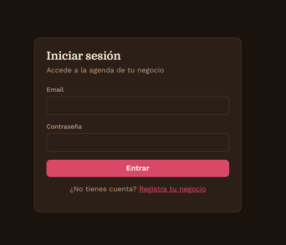
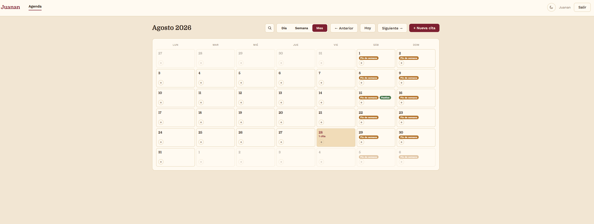

# Peluquería App

Aplicación web para que peluqueros y peluqueras gestionen sus propias citas, sin depender de Google Calendar ni de integraciones de terceros. Pensada como producto multitenant: cada negocio gestiona sus citas de forma independiente dentro de la misma plataforma.

🔗 **Demo en producción:** [peluqueria-app-blush.vercel.app](https://peluqueria-app-blush.vercel.app)

## Características

- Registro y login de negocios (autenticación propia con JWT)
- Alta de citas con un formulario simple: nombre del cliente, día y hora (texto libre, sin franjas predefinidas)
- Multitenant: cada negocio ve y gestiona solo sus propias citas
- Progressive Web App (PWA): instalable directamente desde el navegador, sin pasar por App Store/Google Play
- Panel de administración interno para supervisar los negocios registrados

## Capturas

| Login | Agenda |
|---|---|
|  |  |

## Stack técnico

**Backend**
- Node.js + Express
- PostgreSQL
- Prisma (ORM)
- JWT para autenticación
- Helmet (cabeceras HTTP seguras) y rate limiting

**Frontend**
- React + Vite
- PWA (instalable en iOS/Android)

**Infraestructura**
- Backend desplegado en [Railway](https://railway.app) (con PostgreSQL)
- Frontend desplegado en [Vercel](https://vercel.com)

## Instalación local

```bash
# Clonar el repositorio
git clone https://github.com/juanantoniotwork/peluqueria-app.git
cd peluqueria-app

# Backend
cd backend
npm install
cp .env.example .env   # completa con tus propios valores
npx prisma migrate dev
npm run dev

# Frontend
cd ../frontend
npm install
cp .env.example .env
npm run dev
```

## Notas

Este proyecto no incluye integración de pagos: la relación comercial con cada negocio se gestiona directamente fuera de la aplicación.

---

Proyecto personal de portfolio, desarrollado con Node.js, React y PostgreSQL.
